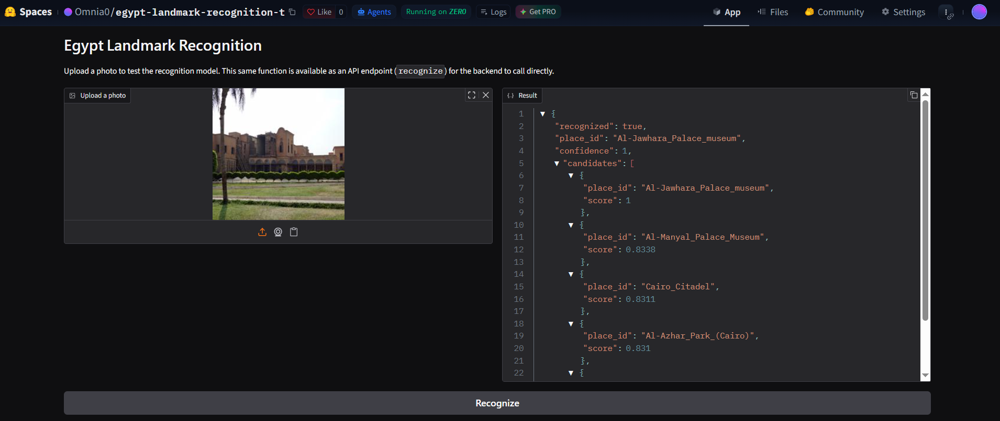

# Landmark Recognition Feature

AI feature for recognizing Egyptian tourist landmarks from images, built for
the Tourism Project.

## Live Demo

The deployed API is running here (Hugging Face Space, Gradio + ZeroGPU):

**[https://huggingface.co/spaces/Omnia0/egypt-landmark-recognition-t](https://huggingface.co/spaces/Omnia0/egypt-landmark-recognition-t)**

Open the link, upload a photo, and see the recognition result directly in
the browser.

## Example



Uploading a photo returns a JSON response like this:

```json
{
  "recognized": true,
  "place_id": "Al-Jawhara_Palace_museum",
  "confidence": 1.0,
  "candidates": [
    {"place_id": "Al-Jawhara_Palace_museum", "score": 1.0},
    {"place_id": "Al-Manyal_Palace_Museum", "score": 0.8338},
    {"place_id": "Cairo_Citadel", "score": 0.8311}
  ]
}
```

> Note: a `confidence` of exactly `1.0` usually means the test photo was one
> of the original reference images from the dataset. For a more realistic
> sense of accuracy, test with a *different* photo of the same place that
> wasn't used to build the index.

## For the backend developer

Read **[`HANDOFF_FOR_BACKEND.md`](./HANDOFF_FOR_BACKEND.md)** first. It
defines exactly what this API returns and how to call it from your code
(via `gradio_client`). This is the only file you need to integrate — you
don't need to read the model code.

## How it works

```
Image → CLIP (embedding) → Similarity search → Recognized landmark
```

The model converts each photo into a numeric "fingerprint" (embedding)
using OpenAI's CLIP model, then compares it against a database of
fingerprints built from the [Egypt Landmarks dataset](https://www.kaggle.com/datasets/aymanmostafa11/eg-landmarks)
(`aymanmostafa11/eg-landmarks` on Kaggle) to find the closest match.

## Project structure

```
Image_Recognition_feature/
├── README.md                  ← you are here
├── HANDOFF_FOR_BACKEND.md     ← read this if you're integrating the API
├── model_training/
│   └── landmark_recognition_kaggle_colab.ipynb   ← builds the reference index from the dataset
├── api_local/                 ← FastAPI version, for local testing/development
│   ├── main.py
│   └── requirements.txt
└── api_deployed/              ← Gradio version, matches what's live on Hugging Face
    ├── app.py
    ├── requirements.txt
    ├── places_index.faiss     ← reference embeddings (source of truth)
    └── places_mapping.json    ← maps index positions to place names
```

## Which version to use

- **`api_deployed/`** — this is the real, live version. The backend should
  call the hosted Space (see `HANDOFF_FOR_BACKEND.md`), not run this
  locally, unless actively working on the recognition model itself.
- **`api_local/`** — a FastAPI version for local development and quick
  testing without depending on Hugging Face's infrastructure or GPU quota.
  Useful while iterating on the model, not meant for production use by the
  mobile app.

## Rebuilding the reference index

If you need to add more landmarks or more reference images, use
`model_training/landmark_recognition_kaggle_colab.ipynb`. It downloads the
dataset from Kaggle, builds the embeddings, and exports
`places_index.faiss` + `places_mapping.json`, which then go into
`api_deployed/` (and `api_local/` if you're using that version too).

## Tech stack

- Python, PyTorch, Hugging Face Transformers (CLIP)
- FAISS (similarity search)
- Gradio + ZeroGPU (deployment)
- FastAPI (local dev version)